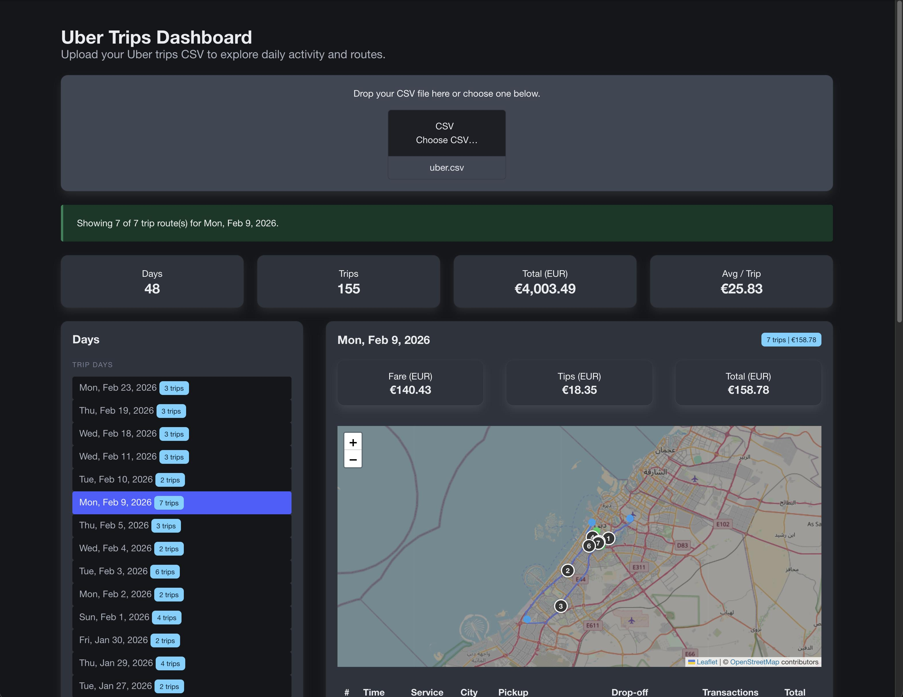

# 🚕 Uber Trips Dashboard

A fast, client-side dashboard to upload your Uber CSV report, explore daily spending, and visualize trips on an interactive map.

## ✨ Highlights
- 📂 Drag & drop CSV upload
- 📅 Trips grouped by day (newest day first)
- 💶 Daily and global spend insights
- 🧾 Day summary: fare, tips, total
- 🗺️ OpenStreetMap route visualization
- 🔢 Numbered trips (table ↔ map)
- 🎯 Hover syncing between rows and map routes
- 🔒 100% client-side processing

## 🌍 Live Demo
[https://niek.github.io/uber-dash/](https://niek.github.io/uber-dash/)

## 🛠️ Tech
- Bulma
- Leaflet + OpenStreetMap
- Photon geocoding API
- OSRM routing API
- Vanilla JavaScript (no framework)

## 🚀 Run Locally
1. Open `index.html` directly in your browser.
2. Upload `uber.csv` (or your own Uber report).
3. Pick a day and explore spend + routes.

## 📌 Notes
- Geocoding depends on Photon and address quality, so some addresses may not resolve perfectly.
- Routes use OSRM road geometry when available, with straight pickup-to-dropoff fallback when routing is unavailable.
